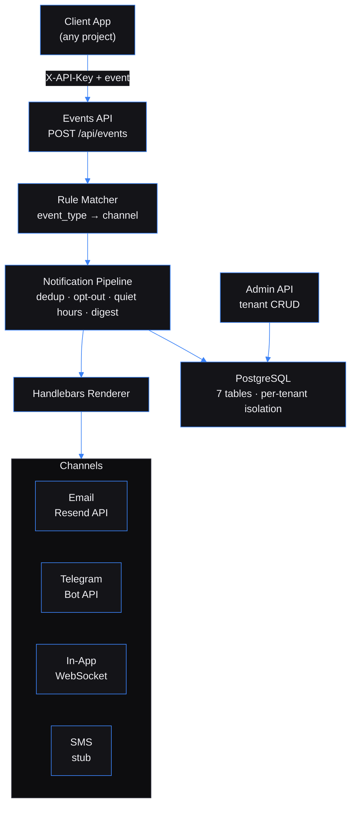

# Event-Driven Notification Hub — Multi-channel notification routing for any app that emits events

Built by [Kingsley Onoh](https://kingsleyonoh.com) · Systems Architect

> **Live:** [notify.kingsleyonoh.com](https://notify.kingsleyonoh.com)

## The Problem

Every internal tool needs email notifications. Task assigned? Email. Deploy failed? Email. Client onboarded? Email. But wiring Resend or SendGrid into each project means duplicating auth, templates, delivery tracking, opt-outs, and deduplication logic across every codebase. The Notification Hub absorbs all of that into one service — projects just fire events and the Hub handles the rest. One Resend domain, one deployment, unlimited consumers.

## Architecture



## Key Decisions

- **Fastify over Express** because Fastify's plugin encapsulation model maps cleanly to multi-tenant middleware. Each plugin (auth, rate limiting, admin auth) can be scoped without leaking state.
- **Direct processing over Kafka in production** because the VPS has 1GB RAM. Redpanda needs 150-200MB just to start. Events arrive via HTTP anyway, so the Kafka round-trip is unnecessary at current scale. Kafka still works locally for dev.
- **Application-level tenant isolation over PostgreSQL RLS** because every query already filters by `tenant_id` via middleware injection. RLS adds overhead for a problem that doesn't exist yet. The upgrade path is a migration, not a rewrite.
- **One Resend domain, per-tenant sender** because Resend only cares about the domain. `portal@notify.klevar.ai` and `alerts@notify.klevar.ai` work from the same verified domain with zero DNS changes per project.
- **Handlebars over React Email** because templates are stored in the database and rendered at runtime. Handlebars compiles from a string. React Email needs a build step.

## Setup

### Prerequisites

- Node.js 22 LTS
- Docker + Docker Compose (for local PostgreSQL + Redpanda)
- A [Resend](https://resend.com) account with a verified domain

### Installation

```bash
git clone https://github.com/kingsleyonoh/Event-Driven-Notification-Hub.git
cd Event-Driven-Notification-Hub
npm install
```

### Environment

```bash
cp .env.example .env.local
```

| Variable | Description | Required |
|----------|-------------|----------|
| `DATABASE_URL` | PostgreSQL connection string | Yes |
| `API_KEYS` | Comma-separated tenant API keys (legacy fallback) | Yes |
| `ADMIN_API_KEY` | Admin key for tenant management endpoints | Yes |
| `RESEND_API_KEY` | Resend email API key (optional if using per-tenant config) | No |
| `RESEND_FROM` | Default sender address (optional if using per-tenant config) | No |
| `USE_KAFKA` | `true` to use Kafka, `false` for direct processing | No (default: `true`) |
| `KAFKA_BROKERS` | Kafka broker addresses | Only if `USE_KAFKA=true` |
| `DEDUP_WINDOW_MINUTES` | Deduplication window | No (default: `60`) |
| `DIGEST_SCHEDULE` | Digest frequency: `hourly`, `daily`, `weekly` | No (default: `daily`) |
| `NOTIFICATION_RETENTION_DAYS` | Days before old notifications are deleted | No (default: `90`) |

### Run

```bash
docker compose up -d        # Start PostgreSQL + Redpanda
npx drizzle-kit migrate     # Apply database migrations
npm run db:seed             # Seed demo tenants
npm run dev                 # Start the Hub
```

## How It Works

Your app fires events. The Hub takes it from there.

```
Your App                          Notification Hub                    User
  │                                     │                              │
  ├─ POST /api/events ─────────────────►│                              │
  │  { event_type: "task.assigned",     │── match rules ──►            │
  │    payload: { title: "Review PR",   │── render template ──►        │
  │              assignee: "j@co.com" }}│── send via Resend ──────────►│ 📧
  │                                     │                              │
```

No notification logic in your codebase. No Resend SDK. No template files. Just one HTTP call.

### Integrating Your App (3 lines of code)

Add this to any TypeScript project:

```typescript
// src/lib/events.ts
export async function emitEvent(eventType: string, payload: Record<string, unknown>) {
  if (process.env.NOTIFICATION_HUB_ENABLED !== 'true') return;
  await fetch(`${process.env.NOTIFICATION_HUB_URL}/api/events`, {
    method: 'POST',
    headers: { 'Content-Type': 'application/json', 'X-API-Key': process.env.NOTIFICATION_HUB_API_KEY! },
    body: JSON.stringify({ event_type: eventType, event_id: `${eventType}-${crypto.randomUUID()}`, payload }),
  }).catch(err => console.error(`[events] ${eventType} failed:`, err));
}
```

Then fire events from anywhere:

```typescript
// When a client is onboarded
await emitEvent('client.onboarded', { clientName: 'Acme Corp', recipientEmail: 'admin@company.com' });

// When a task is submitted
await emitEvent('task.submitted', { title: 'Review PR #42', clientName: 'Acme', recipientEmail: 'dev@company.com' });
```

The Hub matches the event type against your rules, renders the Handlebars template with the payload data, and sends the email. Your app never touches Resend.

### Onboarding a New Project

Each consuming project becomes a **tenant** — isolated rules, templates, API key. Setup takes one admin call:

```bash
# 1. Register your project as a tenant (admin-only, returns API key)
curl -X POST https://notify.kingsleyonoh.com/api/admin/tenants \
  -H "X-Admin-Key: $ADMIN_KEY" \
  -H "Content-Type: application/json" \
  -d '{"name": "My App", "config": {"channels": {"email": {"apiKey": "re_xxx", "from": "My App <app@notify.domain.com>"}}}}'

# 2. Create a template (what the email looks like)
curl -X POST https://notify.kingsleyonoh.com/api/templates \
  -H "X-API-Key: $TENANT_KEY" \
  -H "Content-Type: application/json" \
  -d '{"name": "task-assigned-email", "channel": "email", "subject": "Task: {{title}}", "body": "<h2>{{title}}</h2><p>Assigned to {{assignee}}</p>"}'

# 3. Create a rule (what triggers the email)
curl -X POST https://notify.kingsleyonoh.com/api/rules \
  -H "X-API-Key: $TENANT_KEY" \
  -H "Content-Type: application/json" \
  -d '{"event_type": "task.assigned", "channel": "email", "template_id": "TEMPLATE_ID", "recipient_type": "event_field", "recipient_value": "recipientEmail"}'
```

That's it. Every `task.assigned` event from your app now sends an email.

### What the Hub Handles (So Your App Doesn't)

| Concern | How the Hub handles it |
|---------|----------------------|
| **Deduplication** | Same `event_id` + recipient + channel within 60 min = skipped |
| **Opt-out** | Users set `opt_out: {"email": ["marketing"]}` — Hub enforces per-channel |
| **Quiet hours** | Notifications held during `22:00–07:00` in user's timezone, released after |
| **Digest mode** | User opts into daily/weekly batching — gets one summary email instead of 10 |
| **Multi-channel** | One event can trigger email + Telegram + in-app push via separate rules |
| **Template rendering** | Handlebars templates with `{{payload.field}}` — preview endpoint included |
| **Delivery tracking** | Every notification logged with status (sent/failed/skipped) and reason |
| **Tenant isolation** | Project A's events never trigger Project B's rules |

### Channels

| Channel | Delivery | Setup |
|---------|----------|-------|
| **Email** | Resend API | Per-tenant credentials in tenant config |
| **Telegram** | Bot API | Link via `POST /api/preferences/:userId/telegram/link` |
| **In-App** | WebSocket push | Connect at `ws://host/ws/notifications?userId=X&tenantId=Y` |
| **SMS** | Stub (logs only) | Ready for Twilio/Vonage integration |

## Tests

```bash
npx vitest run
```

269 tests across 42 files. Covers rule matching, template rendering, pipeline processing (opt-out, quiet hours, dedup, digest routing), channel dispatch, admin CRUD, tenant isolation, and WebSocket push.

## Deployment

This project runs on a DigitalOcean VPS behind Traefik with automatic image pulls via Watchtower.

### Production Stack

| Component | Role |
|-----------|------|
| `notification-hub` | Fastify app (direct processing mode, no Kafka) |
| `shared-postgres` | PostgreSQL 16 (shared across all VPS projects) |
| `shared-redis` | Redis 7 (shared across all VPS projects) |
| `traefik` | Reverse proxy with auto-SSL via Let's Encrypt |
| `watchtower` | Auto-pulls new images from GHCR every 5 minutes |

### Self-Host

```bash
# Pull the image
docker pull ghcr.io/kingsleyonoh/notification-hub:latest

# Or use the compose file
docker compose -f docker-compose.prod.yml up -d
```

Set the environment variables listed in **Setup > Environment** before starting. Run `npx drizzle-kit migrate` against your database to create the schema.

<!-- THEATRE_LINK -->
