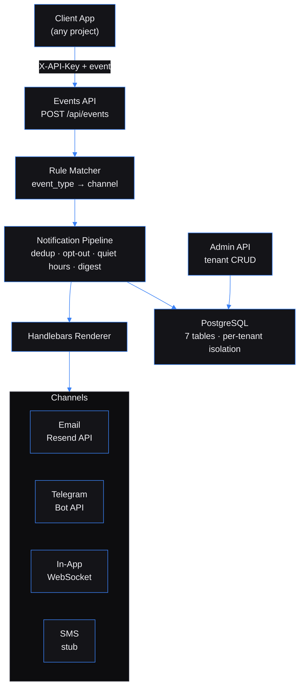

# Event-Driven Notification Hub — Multi-channel notification routing for any app that emits events

Built by [Kingsley Onoh](https://kingsleyonoh.com) · Systems Architect

> **Live:** [notify.kingsleyonoh.com](https://notify.kingsleyonoh.com)

## The Problem

Every internal tool needs email notifications. Task assigned? Email. Deploy failed? Email. Client onboarded? Email. But wiring Resend or SendGrid into each project means duplicating auth, templates, delivery tracking, opt-outs, and deduplication logic across every codebase. The Notification Hub absorbs all of that into one service — projects just fire events and the Hub handles the rest. One Resend domain, one deployment, unlimited consumers.

## Architecture



## Key Decisions

- **Fastify over Express** because Fastify's plugin encapsulation model maps cleanly to multi-tenant middleware. Each plugin (auth, rate limiting, admin auth) can be scoped without leaking state.
- **Direct processing over Kafka in production** because the VPS has 1GB RAM. Redpanda needs 150-200MB just to start. Events arrive via HTTP anyway, so the Kafka round-trip is unnecessary at current scale. Kafka still works locally for dev.
- **Application-level tenant isolation over PostgreSQL RLS** because every query already filters by `tenant_id` via middleware injection. RLS adds overhead for a problem that doesn't exist yet. The upgrade path is a migration, not a rewrite.
- **One Resend domain, per-tenant sender** because Resend only cares about the domain. `portal@notify.klevar.ai` and `alerts@notify.klevar.ai` work from the same verified domain with zero DNS changes per project.
- **Handlebars over React Email** because templates are stored in the database and rendered at runtime. Handlebars compiles from a string. React Email needs a build step.

## Setup

### Prerequisites

- Node.js 22 LTS
- Docker + Docker Compose (for local PostgreSQL + Redpanda)
- A [Resend](https://resend.com) account with a verified domain

### Installation

```bash
git clone https://github.com/kingsleyonoh/Event-Driven-Notification-Hub.git
cd Event-Driven-Notification-Hub
npm install
```

### Environment

```bash
cp .env.example .env.local
```

| Variable | Description | Required |
|----------|-------------|----------|
| `DATABASE_URL` | PostgreSQL connection string | Yes |
| `API_KEYS` | Comma-separated tenant API keys (legacy fallback) | Yes |
| `ADMIN_API_KEY` | Admin key for tenant management endpoints | Yes |
| `RESEND_API_KEY` | Resend email API key (optional if using per-tenant config) | No |
| `RESEND_FROM` | Default sender address (optional if using per-tenant config) | No |
| `USE_KAFKA` | `true` to use Kafka, `false` for direct processing | No (default: `true`) |
| `KAFKA_BROKERS` | Kafka broker addresses | Only if `USE_KAFKA=true` |
| `DEDUP_WINDOW_MINUTES` | Deduplication window | No (default: `60`) |
| `DIGEST_SCHEDULE` | Digest frequency: `hourly`, `daily`, `weekly` | No (default: `daily`) |
| `NOTIFICATION_RETENTION_DAYS` | Days before old notifications are deleted | No (default: `90`) |

### Run

```bash
docker compose up -d        # Start PostgreSQL + Redpanda
npx drizzle-kit migrate     # Apply database migrations
npm run db:seed             # Seed demo tenants
npm run dev                 # Start the Hub
```

## Usage

### 1. Create a Tenant

Every consuming project gets its own tenant. The admin API generates a unique API key.

```bash
curl -X POST https://notify.kingsleyonoh.com/api/admin/tenants \
  -H "X-Admin-Key: $ADMIN_KEY" \
  -H "Content-Type: application/json" \
  -d '{
    "name": "My App",
    "config": {
      "channels": {
        "email": {
          "apiKey": "re_your_resend_key",
          "from": "My App <app@notify.yourdomain.com>"
        }
      }
    }
  }'
```

Response (API key shown only once):
```json
{
  "tenant": {
    "id": "my-app-a1b2c3d4",
    "name": "My App",
    "apiKey": "f8a2b1c9d4e5...",
    "enabled": true
  }
}
```

### 2. Create a Template

Templates use Handlebars syntax. Variables come from the event payload.

```bash
curl -X POST https://notify.kingsleyonoh.com/api/templates \
  -H "X-API-Key: $TENANT_API_KEY" \
  -H "Content-Type: application/json" \
  -d '{
    "name": "order-completed-email",
    "channel": "email",
    "subject": "Order #{{orderId}} Completed",
    "body": "<h2>Order Complete</h2><p>Hi {{customerName}}, your order #{{orderId}} has shipped.</p>"
  }'
```

### 3. Create a Routing Rule

Rules map event types to channels and recipients.

```bash
curl -X POST https://notify.kingsleyonoh.com/api/rules \
  -H "X-API-Key: $TENANT_API_KEY" \
  -H "Content-Type: application/json" \
  -d '{
    "event_type": "order.completed",
    "channel": "email",
    "template_id": "TEMPLATE_ID_FROM_STEP_2",
    "recipient_type": "event_field",
    "recipient_value": "customerEmail"
  }'
```

Recipient types: `static` (hardcoded address), `event_field` (extract from payload — works with both user IDs and direct email addresses).

### 4. Fire an Event

From your project, POST events to the Hub. The Hub matches rules, renders templates, and delivers.

```bash
curl -X POST https://notify.kingsleyonoh.com/api/events \
  -H "X-API-Key: $TENANT_API_KEY" \
  -H "Content-Type: application/json" \
  -d '{
    "event_type": "order.completed",
    "event_id": "order-12345",
    "payload": {
      "orderId": "12345",
      "customerName": "Jane",
      "customerEmail": "jane@example.com"
    }
  }'
```

Response: `{"published": true, "processed": 1}`

The email arrives at `jane@example.com` with subject "Order #12345 Completed".

### 5. Check Delivery Status

```bash
curl https://notify.kingsleyonoh.com/api/notifications?limit=5 \
  -H "X-API-Key: $TENANT_API_KEY"
```

```json
{
  "notifications": [
    {
      "eventType": "order.completed",
      "channel": "email",
      "status": "sent",
      "recipient": "jane@example.com",
      "subject": "Order #12345 Completed",
      "deliveredAt": "2026-04-07T14:28:31.150Z"
    }
  ]
}
```

### User Preferences

Users can opt out of channels, set quiet hours, or enable digest mode:

```bash
curl -X PUT https://notify.kingsleyonoh.com/api/preferences/user-123 \
  -H "X-API-Key: $TENANT_API_KEY" \
  -H "Content-Type: application/json" \
  -d '{
    "email": "user@example.com",
    "opt_out": {"email": ["marketing"]},
    "quiet_hours": {"start": "22:00", "end": "07:00", "timezone": "Europe/Berlin"},
    "digest_mode": true,
    "digest_schedule": "daily"
  }'
```

### Channels

| Channel | How it works |
|---------|-------------|
| **Email** | Sent via Resend API. Per-tenant credentials in `config.channels.email`. |
| **Telegram** | Sent via Bot API. Link accounts via `POST /api/preferences/:userId/telegram/link`. |
| **In-App** | Pushed over WebSocket at `ws://host/ws/notifications?userId=X&tenantId=Y`. |
| **SMS** | Stub — logs the message. Ready for Twilio/Vonage integration. |

## Tests

```bash
npx vitest run
```

269 tests across 42 files. Covers rule matching, template rendering, pipeline processing (opt-out, quiet hours, dedup, digest routing), channel dispatch, admin CRUD, tenant isolation, and WebSocket push.

## Deployment

This project runs on a DigitalOcean VPS behind Traefik with automatic image pulls via Watchtower.

### Production Stack

| Component | Role |
|-----------|------|
| `notification-hub` | Fastify app (direct processing mode, no Kafka) |
| `shared-postgres` | PostgreSQL 16 (shared across all VPS projects) |
| `shared-redis` | Redis 7 (shared across all VPS projects) |
| `traefik` | Reverse proxy with auto-SSL via Let's Encrypt |
| `watchtower` | Auto-pulls new images from GHCR every 5 minutes |

### Self-Host

```bash
# Pull the image
docker pull ghcr.io/kingsleyonoh/notification-hub:latest

# Or use the compose file
docker compose -f docker-compose.prod.yml up -d
```

Set the environment variables listed in **Setup > Environment** before starting. Run `npx drizzle-kit migrate` against your database to create the schema.

<!-- THEATRE_LINK -->
